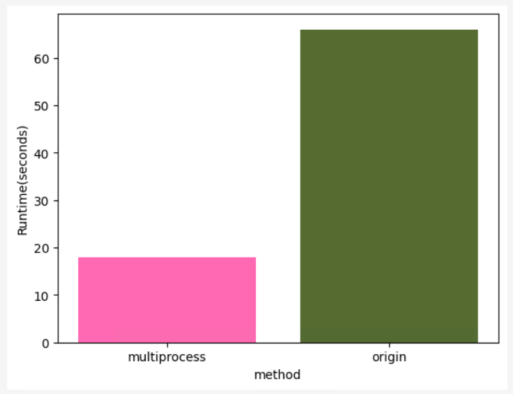

# interpolation
A tool for parallel computation of Inverse Distance Weighted (IDW) interpolation from point vector layer multiprocessing module

process on single-desktop: Intel(R) Core(TM) i7-11800H @ 2.30GHz 8-core CPU and 32GB of RAM
with sample data 445 points

